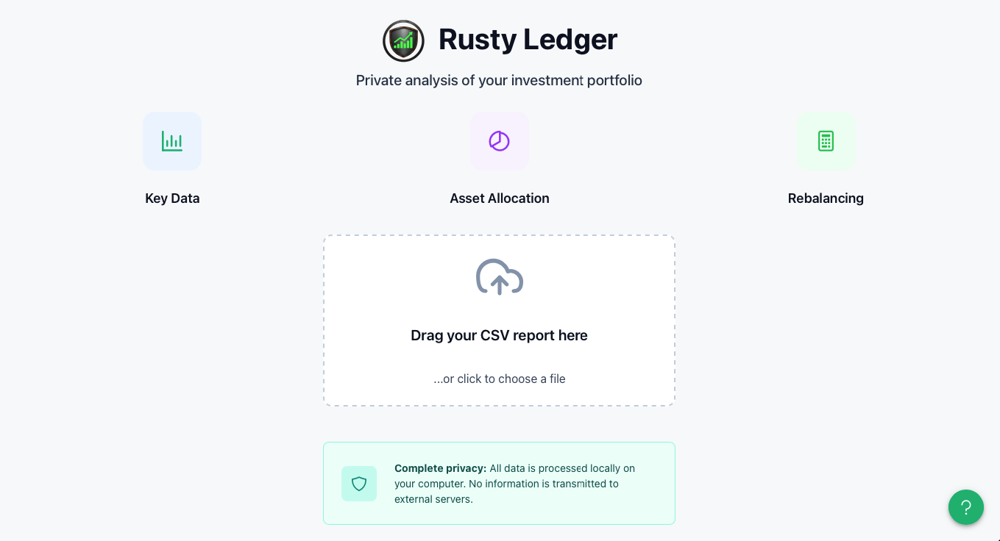
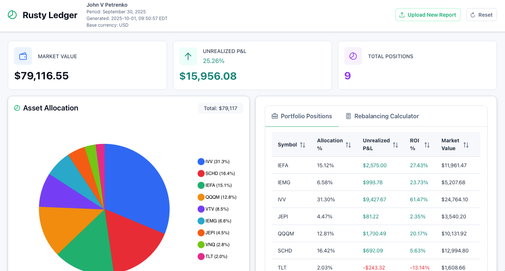
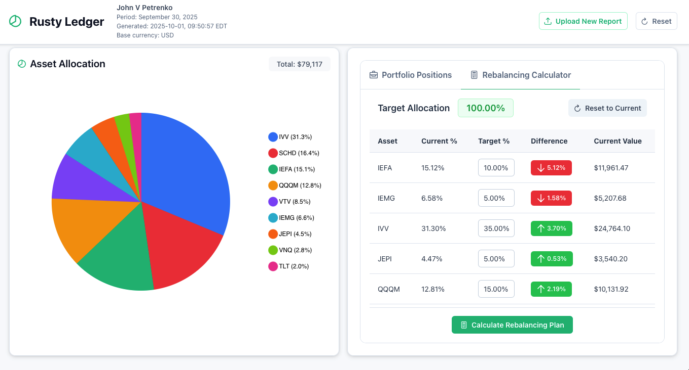

# Rusty Ledger

Rusty Ledger is a privacy-first desktop app for portfolio analysis, built with Tauri and Vue.js so every insight stays on your machine. Right now the app lets you drag in an Interactive Brokers CSV report to:

- See portfolio market value, unrealized P&L (absolute and %), and total positions at a glance.
- Explore an asset allocation pie chart with auto-grouped minor holdings.
- Browse a sortable PrimeVue table of positions with allocation, ROI, and market value.
- Configure target allocations and generate a suggested buy/sell plan for rebalancing.

## Screenshots

  
  
  
  

## Supported Statements

Rusty Ledger currently supports account statements from Interactive Brokers, the most reliable U.S. broker available to Ukrainians. To load your data:

- Download the latest CSV statement from Interactive Brokers via **Performance & Reports → Statements → Activity Statement → Download CSV**. A daily statement is sufficient, and the language must be set to English.
- Upload the downloaded CSV file into the app to begin exploring your portfolio.
- For quick testing, use the bundled `docs/test_report.csv` sample statement.

## Privacy & Security

- All data is processed locally on your computer.
- No network requests are made while your data is being processed.
- Data is cleared automatically when you close the app.
- The project is open source, ensuring full transparency.

## Technology Stack

- **Frontend:** Vue.js 3 with PrimeVue.
- **Backend:** Rust powered by Tauri.
- **Visualizations:** Chart.js.

## Installation

- Install the prerequisites for a Tauri project: recent Rust toolchain, Node.js 18+ (with npm), and the system dependencies listed in the [Tauri setup guide](https://tauri.app/v1/guides/getting-started/prerequisites/).
- Clone this repository and install frontend dependencies with `npm install`.

## Development & Build

- Run `npm run dev` to start the Vite dev server alongside the Tauri shell.
- Run `npm run build` for a production-ready frontend build.
- Run `npm run tauri build` to produce a packaged desktop application.

## SQLx Offline Cache Workflow

SQLx validates `query!` / `query_as!` macros at compile time against a real database. The runtime DB lives in the OS app data directory, but a local `dev.db` is needed for development builds.

**One-time setup** (run from `src-tauri/`):

1. Install `sqlx-cli` if you haven't already:
   - `cargo install sqlx-cli --no-default-features --features sqlite`
2. Copy the example env file:
   - `cp .env.example .env`
3. Create the local dev database and apply migrations:
   - `sqlx migrate run --source src/infra/persistence/migrations --database-url "sqlite://$(pwd)/dev.db?mode=rwc"`

**After adding a new migration**, re-run step 3 to keep `dev.db` up to date.

**Regenerate the SQLx offline cache** (run from `src-tauri/`):
- `cargo sqlx prepare -- --all-targets`
- Commit the updated `src-tauri/.sqlx` directory to the repository.

**CI or builds without a database:**
- `SQLX_OFFLINE=true cargo check`
